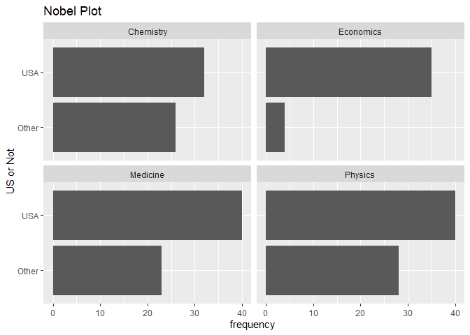
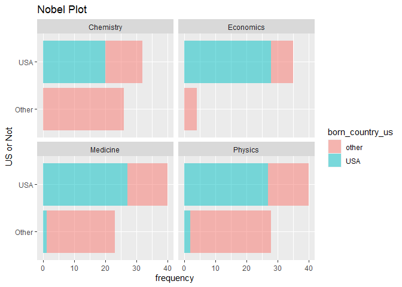

Lab 03 - Nobel laureates
================
Yoo RI
30th Jan

### Load packages and data

``` r
library(tidyverse) 
library(ggplot2)
```

``` r
nobel <- read.csv("data/nobel.csv")
```

## Exercises

### Exercise 1

``` r
str(nobel)
```

    ## 'data.frame':    935 obs. of  26 variables:
    ##  $ id                   : int  1 2 3 4 5 6 6 8 9 10 ...
    ##  $ firstname            : chr  "Wilhelm Conrad" "Hendrik A." "Pieter" "Henri" ...
    ##  $ surname              : chr  "Röntgen" "Lorentz" "Zeeman" "Becquerel" ...
    ##  $ year                 : int  1901 1902 1902 1903 1903 1903 1911 1904 1905 1906 ...
    ##  $ category             : chr  "Physics" "Physics" "Physics" "Physics" ...
    ##  $ affiliation          : chr  "Munich University" "Leiden University" "Amsterdam University" "École Polytechnique" ...
    ##  $ city                 : chr  "Munich" "Leiden" "Amsterdam" "Paris" ...
    ##  $ country              : chr  "Germany" "Netherlands" "Netherlands" "France" ...
    ##  $ born_date            : chr  "1845-03-27" "1853-07-18" "1865-05-25" "1852-12-15" ...
    ##  $ died_date            : chr  "1923-02-10" "1928-02-04" "1943-10-09" "1908-08-25" ...
    ##  $ gender               : chr  "male" "male" "male" "male" ...
    ##  $ born_city            : chr  "Remscheid" "Arnhem" "Zonnemaire" "Paris" ...
    ##  $ born_country         : chr  "Germany" "Netherlands" "Netherlands" "France" ...
    ##  $ born_country_code    : chr  "DE" "NL" "NL" "FR" ...
    ##  $ died_city            : chr  "Munich" NA "Amsterdam" NA ...
    ##  $ died_country         : chr  "Germany" "Netherlands" "Netherlands" "France" ...
    ##  $ died_country_code    : chr  "DE" "NL" "NL" "FR" ...
    ##  $ overall_motivation   : chr  NA NA NA NA ...
    ##  $ share                : int  1 2 2 2 4 4 1 1 1 1 ...
    ##  $ motivation           : chr  "\"in recognition of the extraordinary services he has rendered by the discovery of the remarkable rays subseque"| __truncated__ "\"in recognition of the extraordinary service they rendered by their researches into the influence of magnetism"| __truncated__ "\"in recognition of the extraordinary service they rendered by their researches into the influence of magnetism"| __truncated__ "\"in recognition of the extraordinary services he has rendered by his discovery of spontaneous radioactivity\"" ...
    ##  $ born_country_original: chr  "Prussia (now Germany)" "the Netherlands" "the Netherlands" "France" ...
    ##  $ born_city_original   : chr  "Lennep (now Remscheid)" "Arnhem" "Zonnemaire" "Paris" ...
    ##  $ died_country_original: chr  "Germany" "the Netherlands" "the Netherlands" "France" ...
    ##  $ died_city_original   : chr  "Munich" NA "Amsterdam" NA ...
    ##  $ city_original        : chr  "Munich" "Leiden" "Amsterdam" "Paris" ...
    ##  $ country_original     : chr  "Germany" "the Netherlands" "the Netherlands" "France" ...

26 variable, each person

``` r
nobel_living<- nobel %>%
  filter(!is.na(country),
         gender!="org",
         is.na(died_date))

str(nobel_living)
```

    ## 'data.frame':    228 obs. of  26 variables:
    ##  $ id                   : int  68 69 95 97 98 99 101 103 106 107 ...
    ##  $ firstname            : chr  "Chen Ning" "Tsung-Dao" "Leon N." "Leo" ...
    ##  $ surname              : chr  "Yang" "Lee" "Cooper" "Esaki" ...
    ##  $ year                 : int  1957 1957 1972 1973 1973 1973 1974 1975 1976 1977 ...
    ##  $ category             : chr  "Physics" "Physics" "Physics" "Physics" ...
    ##  $ affiliation          : chr  "Institute for Advanced Study" "Columbia University" "Brown University" "IBM Thomas J. Watson Research Center" ...
    ##  $ city                 : chr  "Princeton NJ" "New York NY" "Providence RI" "Yorktown Heights NY" ...
    ##  $ country              : chr  "USA" "USA" "USA" "USA" ...
    ##  $ born_date            : chr  "1922-09-22" "1926-11-24" "1930-02-28" "1925-03-12" ...
    ##  $ died_date            : chr  NA NA NA NA ...
    ##  $ gender               : chr  "male" "male" "male" "male" ...
    ##  $ born_city            : chr  "Hofei Anhwei" "Shanghai" "New York NY" "Osaka" ...
    ##  $ born_country         : chr  "China" "China" "USA" "Japan" ...
    ##  $ born_country_code    : chr  "CN" "CN" "US" "JP" ...
    ##  $ died_city            : chr  NA NA NA NA ...
    ##  $ died_country         : chr  NA NA NA NA ...
    ##  $ died_country_code    : chr  NA NA NA NA ...
    ##  $ overall_motivation   : chr  NA NA NA NA ...
    ##  $ share                : int  2 2 3 4 4 2 2 3 2 3 ...
    ##  $ motivation           : chr  "\"for their penetrating investigation of the so-called parity laws which has led to important discoveries regar"| __truncated__ "\"for their penetrating investigation of the so-called parity laws which has led to important discoveries regar"| __truncated__ "\"for their jointly developed theory of superconductivity usually called the BCS-theory\"" "\"for their experimental discoveries regarding tunneling phenomena in semiconductors and superconductors respectively\"" ...
    ##  $ born_country_original: chr  "China" "China" "USA" "Japan" ...
    ##  $ born_city_original   : chr  "Hofei Anhwei" "Shanghai" "New York NY" "Osaka" ...
    ##  $ died_country_original: chr  NA NA NA NA ...
    ##  $ died_city_original   : chr  NA NA NA NA ...
    ##  $ city_original        : chr  "Princeton NJ" "New York NY" "Providence RI" "Yorktown Heights NY" ...
    ##  $ country_original     : chr  "USA" "USA" "USA" "USA" ...

### Exercise 2 , 3

%in% if certain vector contains specific value or not

``` r
nobel_living <- nobel_living %>%
  mutate(country_us = if_else(country == "USA", "USA", "Other")
  ) 

nobel_living_science <- nobel_living %>%
  filter(category %in% c("Physics","Medicine", "Chemistry","Economics"))

print(head(nobel_living_science,30))
```

    ##     id      firstname         surname year category
    ## 1   68      Chen Ning            Yang 1957  Physics
    ## 2   69      Tsung-Dao             Lee 1957  Physics
    ## 3   95        Leon N.          Cooper 1972  Physics
    ## 4   97            Leo           Esaki 1973  Physics
    ## 5   98           Ivar         Giaever 1973  Physics
    ## 6   99       Brian D.       Josephson 1973  Physics
    ## 7  101         Antony          Hewish 1974  Physics
    ## 8  103         Ben R.       Mottelson 1975  Physics
    ## 9  106    Samuel C.C.            Ting 1976  Physics
    ## 10 107      Philip W.        Anderson 1977  Physics
    ## 11 111           Arno         Penzias 1978  Physics
    ## 12 112 Robert Woodrow          Wilson 1978  Physics
    ## 13 113        Sheldon         Glashow 1979  Physics
    ## 14 115         Steven        Weinberg 1979  Physics
    ## 15 124          Carlo          Rubbia 1984  Physics
    ## 16 126          Klaus    von Klitzing 1985  Physics
    ## 17 128           Gerd          Binnig 1986  Physics
    ## 18 130       J. Georg         Bednorz 1987  Physics
    ## 19 131        K. Alex         Müller 1987  Physics
    ## 20 134           Jack     Steinberger 1988  Physics
    ## 21 138      Jerome I.        Friedman 1990  Physics
    ## 22 143     Russell A.           Hulse 1993  Physics
    ## 23 144      Joseph H.      Taylor Jr. 1993  Physics
    ## 24 149       David M.             Lee 1996  Physics
    ## 25 150     Douglas D.        Osheroff 1996  Physics
    ## 26 152         Steven             Chu 1997  Physics
    ## 27 153         Claude Cohen-Tannoudji 1997  Physics
    ## 28 154     William D.        Phillips 1997  Physics
    ## 29 155      Robert B.        Laughlin 1998  Physics
    ## 30 156       Horst L.        Störmer 1998  Physics
    ##                                       affiliation                city
    ## 1                    Institute for Advanced Study        Princeton NJ
    ## 2                             Columbia University         New York NY
    ## 3                                Brown University       Providence RI
    ## 4            IBM Thomas J. Watson Research Center Yorktown Heights NY
    ## 5                        General Electric Company      Schenectady NY
    ## 6                         University of Cambridge           Cambridge
    ## 7                         University of Cambridge           Cambridge
    ## 8                                         Nordita          Copenhagen
    ## 9     Massachusetts Institute of Technology (MIT)        Cambridge MA
    ## 10                    Bell Telephone Laboratories      Murray Hill NJ
    ## 11                              Bell Laboratories          Holmdel NJ
    ## 12                              Bell Laboratories          Holmdel NJ
    ## 13            Harvard University Lyman Laboratory        Cambridge MA
    ## 14                             Harvard University        Cambridge MA
    ## 15                                           CERN              Geneva
    ## 16  Max-Planck-Institut für Festkörperforschung           Stuttgart
    ## 17                 IBM Zurich Research Laboratory         Rüschlikon
    ## 18                 IBM Zurich Research Laboratory         Rüschlikon
    ## 19                 IBM Zurich Research Laboratory         Rüschlikon
    ## 20                                           CERN              Geneva
    ## 21    Massachusetts Institute of Technology (MIT)        Cambridge MA
    ## 22                           Princeton University        Princeton NJ
    ## 23                           Princeton University        Princeton NJ
    ## 24                             Cornell University           Ithaca NY
    ## 25                            Stanford University         Stanford CA
    ## 26                            Stanford University         Stanford CA
    ## 27                             Collège de France               Paris
    ## 28 National Institute of Standards and Technology     Gaithersburg MD
    ## 29                            Stanford University         Stanford CA
    ## 30                            Columbia University         New York NY
    ##           country  born_date died_date gender             born_city
    ## 1             USA 1922-09-22      <NA>   male          Hofei Anhwei
    ## 2             USA 1926-11-24      <NA>   male              Shanghai
    ## 3             USA 1930-02-28      <NA>   male           New York NY
    ## 4             USA 1925-03-12      <NA>   male                 Osaka
    ## 5             USA 1929-04-05      <NA>   male                Bergen
    ## 6  United Kingdom 1940-01-04      <NA>   male               Cardiff
    ## 7  United Kingdom 1924-05-11      <NA>   male                 Fowey
    ## 8         Denmark 1926-07-09      <NA>   male            Chicago IL
    ## 9             USA 1936-01-27      <NA>   male          Ann Arbor MI
    ## 10            USA 1923-12-13      <NA>   male       Indianapolis IN
    ## 11            USA 1933-04-26      <NA>   male                Munich
    ## 12            USA 1936-01-10      <NA>   male            Houston TX
    ## 13            USA 1932-12-05      <NA>   male           New York NY
    ## 14            USA 1933-05-03      <NA>   male           New York NY
    ## 15    Switzerland 1934-03-31      <NA>   male               Gorizia
    ## 16        Germany 1943-06-28      <NA>   male               Schroda
    ## 17    Switzerland 1947-07-20      <NA>   male Frankfurt-on-the-Main
    ## 18    Switzerland 1950-05-16      <NA>   male          Neuenkirchen
    ## 19    Switzerland 1927-04-20      <NA>   male                 Basel
    ## 20    Switzerland 1921-05-25      <NA>   male         Bad Kissingen
    ## 21            USA 1930-03-28      <NA>   male            Chicago IL
    ## 22            USA 1950-11-28      <NA>   male           New York NY
    ## 23            USA 1941-03-29      <NA>   male       Philadelphia PA
    ## 24            USA 1931-01-20      <NA>   male                Rye NY
    ## 25            USA 1945-08-01      <NA>   male           Aberdeen WA
    ## 26            USA 1948-02-28      <NA>   male          St. Louis MO
    ## 27         France 1933-04-01      <NA>   male           Constantine
    ## 28            USA 1948-11-05      <NA>   male       Wilkes-Barre PA
    ## 29            USA 1950-11-01      <NA>   male            Visalia CA
    ## 30            USA 1949-04-06      <NA>   male Frankfurt-on-the-Main
    ##      born_country born_country_code died_city died_country died_country_code
    ## 1           China                CN      <NA>         <NA>              <NA>
    ## 2           China                CN      <NA>         <NA>              <NA>
    ## 3             USA                US      <NA>         <NA>              <NA>
    ## 4           Japan                JP      <NA>         <NA>              <NA>
    ## 5          Norway                NO      <NA>         <NA>              <NA>
    ## 6  United Kingdom                GB      <NA>         <NA>              <NA>
    ## 7  United Kingdom                GB      <NA>         <NA>              <NA>
    ## 8             USA                US      <NA>         <NA>              <NA>
    ## 9             USA                US      <NA>         <NA>              <NA>
    ## 10            USA                US      <NA>         <NA>              <NA>
    ## 11        Germany                DE      <NA>         <NA>              <NA>
    ## 12            USA                US      <NA>         <NA>              <NA>
    ## 13            USA                US      <NA>         <NA>              <NA>
    ## 14            USA                US      <NA>         <NA>              <NA>
    ## 15          Italy                IT      <NA>         <NA>              <NA>
    ## 16         Poland                PL      <NA>         <NA>              <NA>
    ## 17        Germany                DE      <NA>         <NA>              <NA>
    ## 18        Germany                DE      <NA>         <NA>              <NA>
    ## 19    Switzerland                CH      <NA>         <NA>              <NA>
    ## 20        Germany                DE      <NA>         <NA>              <NA>
    ## 21            USA                US      <NA>         <NA>              <NA>
    ## 22            USA                US      <NA>         <NA>              <NA>
    ## 23            USA                US      <NA>         <NA>              <NA>
    ## 24            USA                US      <NA>         <NA>              <NA>
    ## 25            USA                US      <NA>         <NA>              <NA>
    ## 26            USA                US      <NA>         <NA>              <NA>
    ## 27        Algeria                DZ      <NA>         <NA>              <NA>
    ## 28            USA                US      <NA>         <NA>              <NA>
    ## 29            USA                US      <NA>         <NA>              <NA>
    ## 30        Germany                DE      <NA>         <NA>              <NA>
    ##    overall_motivation share
    ## 1                <NA>     2
    ## 2                <NA>     2
    ## 3                <NA>     3
    ## 4                <NA>     4
    ## 5                <NA>     4
    ## 6                <NA>     2
    ## 7                <NA>     2
    ## 8                <NA>     3
    ## 9                <NA>     2
    ## 10               <NA>     3
    ## 11               <NA>     4
    ## 12               <NA>     4
    ## 13               <NA>     3
    ## 14               <NA>     3
    ## 15               <NA>     2
    ## 16               <NA>     1
    ## 17               <NA>     4
    ## 18               <NA>     2
    ## 19               <NA>     2
    ## 20               <NA>     3
    ## 21               <NA>     3
    ## 22               <NA>     2
    ## 23               <NA>     2
    ## 24               <NA>     3
    ## 25               <NA>     3
    ## 26               <NA>     3
    ## 27               <NA>     3
    ## 28               <NA>     3
    ## 29               <NA>     3
    ## 30               <NA>     3
    ##                                                                                                                                                                                                                  motivation
    ## 1                                                                              "for their penetrating investigation of the so-called parity laws which has led to important discoveries regarding the elementary particles"
    ## 2                                                                              "for their penetrating investigation of the so-called parity laws which has led to important discoveries regarding the elementary particles"
    ## 3                                                                                                                                   "for their jointly developed theory of superconductivity usually called the BCS-theory"
    ## 4                                                                                                     "for their experimental discoveries regarding tunneling phenomena in semiconductors and superconductors respectively"
    ## 5                                                                                                     "for their experimental discoveries regarding tunneling phenomena in semiconductors and superconductors respectively"
    ## 6                                           "for his theoretical predictions of the properties of a supercurrent through a tunnel barrier in particular those phenomena which are generally known as the Josephson effects"
    ## 7            "for their pioneering research in radio astrophysics: Ryle for his observations and inventions in particular of the aperture synthesis technique and Hewish for his decisive role in the discovery of pulsars"
    ## 8                    "for the discovery of the connection between collective motion and particle motion in atomic nuclei and the development of the theory of the structure of the atomic nucleus based on this connection"
    ## 9                                                                                                                                 "for their pioneering work in the discovery of a heavy elementary particle of a new kind"
    ## 10                                                                                                        "for their fundamental theoretical investigations of the electronic structure of magnetic and disordered systems"
    ## 11                                                                                                                                                           "for their discovery of cosmic microwave background radiation"
    ## 12                                                                                                                                                           "for their discovery of cosmic microwave background radiation"
    ## 13                                 "for their contributions to the theory of the unified weak and electromagnetic interaction between elementary particles including inter alia the prediction of the weak neutral current"
    ## 14                                 "for their contributions to the theory of the unified weak and electromagnetic interaction between elementary particles including inter alia the prediction of the weak neutral current"
    ## 15                                                                      "for their decisive contributions to the large project which led to the discovery of the field particles W and Z communicators of weak interaction"
    ## 16                                                                                                                                                                         "for the discovery of the quantized Hall effect"
    ## 17                                                                                                                                                                  "for their design of the scanning tunneling microscope"
    ## 18                                                                                                                           "for their important break-through in the discovery of superconductivity in ceramic materials"
    ## 19                                                                                                                           "for their important break-through in the discovery of superconductivity in ceramic materials"
    ## 20                                                                                  "for the neutrino beam method and the demonstration of the doublet structure of the leptons through the discovery of the muon neutrino"
    ## 21 "for their pioneering investigations concerning deep inelastic scattering of electrons on protons and bound neutrons which have been of essential importance for the development of the quark model in particle physics"
    ## 22                                                                                                "for the discovery of a new type of pulsar a discovery that has opened up new possibilities for the study of gravitation"
    ## 23                                                                                                "for the discovery of a new type of pulsar a discovery that has opened up new possibilities for the study of gravitation"
    ## 24                                                                                                                                                                       "for their discovery of superfluidity in helium-3"
    ## 25                                                                                                                                                                       "for their discovery of superfluidity in helium-3"
    ## 26                                                                                                                                                     "for development of methods to cool and trap atoms with laser light"
    ## 27                                                                                                                                                     "for development of methods to cool and trap atoms with laser light"
    ## 28                                                                                                                                                     "for development of methods to cool and trap atoms with laser light"
    ## 29                                                                                                                               "for their discovery of a new form of quantum fluid with fractionally charged excitations"
    ## 30                                                                                                                               "for their discovery of a new form of quantum fluid with fractionally charged excitations"
    ##                  born_country_original    born_city_original
    ## 1                                China          Hofei Anhwei
    ## 2                                China              Shanghai
    ## 3                                  USA           New York NY
    ## 4                                Japan                 Osaka
    ## 5                               Norway                Bergen
    ## 6                       United Kingdom               Cardiff
    ## 7                       United Kingdom                 Fowey
    ## 8                                  USA            Chicago IL
    ## 9                                  USA          Ann Arbor MI
    ## 10                                 USA       Indianapolis IN
    ## 11                             Germany                Munich
    ## 12                                 USA            Houston TX
    ## 13                                 USA           New York NY
    ## 14                                 USA           New York NY
    ## 15                               Italy               Gorizia
    ## 16 German-occupied Poland (now Poland)               Schroda
    ## 17          West Germany (now Germany) Frankfurt-on-the-Main
    ## 18          West Germany (now Germany)          Neuenkirchen
    ## 19                         Switzerland                 Basel
    ## 20                             Germany         Bad Kissingen
    ## 21                                 USA            Chicago IL
    ## 22                                 USA           New York NY
    ## 23                                 USA       Philadelphia PA
    ## 24                                 USA                Rye NY
    ## 25                                 USA           Aberdeen WA
    ## 26                                 USA          St. Louis MO
    ## 27        French Algeria (now Algeria)           Constantine
    ## 28                                 USA       Wilkes-Barre PA
    ## 29                                 USA            Visalia CA
    ## 30          West Germany (now Germany) Frankfurt-on-the-Main
    ##    died_country_original died_city_original       city_original
    ## 1                   <NA>               <NA>        Princeton NJ
    ## 2                   <NA>               <NA>         New York NY
    ## 3                   <NA>               <NA>       Providence RI
    ## 4                   <NA>               <NA> Yorktown Heights NY
    ## 5                   <NA>               <NA>      Schenectady NY
    ## 6                   <NA>               <NA>           Cambridge
    ## 7                   <NA>               <NA>           Cambridge
    ## 8                   <NA>               <NA>          Copenhagen
    ## 9                   <NA>               <NA>        Cambridge MA
    ## 10                  <NA>               <NA>      Murray Hill NJ
    ## 11                  <NA>               <NA>          Holmdel NJ
    ## 12                  <NA>               <NA>          Holmdel NJ
    ## 13                  <NA>               <NA>        Cambridge MA
    ## 14                  <NA>               <NA>        Cambridge MA
    ## 15                  <NA>               <NA>              Geneva
    ## 16                  <NA>               <NA>           Stuttgart
    ## 17                  <NA>               <NA>         Rüschlikon
    ## 18                  <NA>               <NA>         Rüschlikon
    ## 19                  <NA>               <NA>         Rüschlikon
    ## 20                  <NA>               <NA>              Geneva
    ## 21                  <NA>               <NA>        Cambridge MA
    ## 22                  <NA>               <NA>        Princeton NJ
    ## 23                  <NA>               <NA>        Princeton NJ
    ## 24                  <NA>               <NA>           Ithaca NY
    ## 25                  <NA>               <NA>         Stanford CA
    ## 26                  <NA>               <NA>         Stanford CA
    ## 27                  <NA>               <NA>               Paris
    ## 28                  <NA>               <NA>     Gaithersburg MD
    ## 29                  <NA>               <NA>         Stanford CA
    ## 30                  <NA>               <NA>         New York NY
    ##    country_original country_us
    ## 1               USA        USA
    ## 2               USA        USA
    ## 3               USA        USA
    ## 4               USA        USA
    ## 5               USA        USA
    ## 6    United Kingdom      Other
    ## 7    United Kingdom      Other
    ## 8           Denmark      Other
    ## 9               USA        USA
    ## 10              USA        USA
    ## 11              USA        USA
    ## 12              USA        USA
    ## 13              USA        USA
    ## 14              USA        USA
    ## 15      Switzerland      Other
    ## 16          Germany      Other
    ## 17      Switzerland      Other
    ## 18      Switzerland      Other
    ## 19      Switzerland      Other
    ## 20      Switzerland      Other
    ## 21              USA        USA
    ## 22              USA        USA
    ## 23              USA        USA
    ## 24              USA        USA
    ## 25              USA        USA
    ## 26              USA        USA
    ## 27           France      Other
    ## 28              USA        USA
    ## 29              USA        USA
    ## 30              USA        USA

``` r
ggplot(data = nobel_living_science,
       mapping = aes(x=country_us)) +
  geom_bar() +
  coord_flip() +
  facet_wrap(~category) +
  labs(title="Nobel Plot", x="US or Not", y="frequency ")
```

<!-- -->

### Exercise 4,5,6

``` r
#4
nobel_living_science <- nobel_living_science %>%
  dplyr::mutate(born_country_us = dplyr::case_when(
    born_country == "USA" ~ "USA",
    born_country!="USA" ~ "other",
    TRUE ~ NA_character_))

table(nobel_living_science$born_country_us)
```

    ## 
    ## other   USA 
    ##   123   105

``` r
#5

ggplot(data = nobel_living_science,
       mapping = aes(x=country_us, fill=born_country_us)) +
  geom_bar( alpha=0.5) +
  coord_flip() +
  facet_wrap(~category) +
  labs(title="Nobel Plot", x="US or Not", y="frequency ")
```

<!-- -->

``` r
 #6
nobel_living_science2 <- nobel_living_science %>%
  dplyr::filter( country =="USA",
         born_country!="USA") %>%
  count(born_country) %>%
  arrange(desc(n)) %>%
  print()
```

    ##      born_country n
    ## 1         Germany 7
    ## 2  United Kingdom 7
    ## 3           China 5
    ## 4          Canada 4
    ## 5           Japan 3
    ## 6       Australia 2
    ## 7          Israel 2
    ## 8          Norway 2
    ## 9         Austria 1
    ## 10        Finland 1
    ## 11         France 1
    ## 12        Ireland 1
    ## 13          Italy 1
    ## 14      Lithuania 1
    ## 15         Mexico 1
    ## 16       Scotland 1
    ## 17   South Africa 1
    ## 18         Sweden 1
    ## 19         Taiwan 1
    ## 20         Turkey 1
    ## 21        Ukraine 1

``` r
nobel_living_science$country
```

    ##   [1] "USA"            "USA"            "USA"            "USA"           
    ##   [5] "USA"            "United Kingdom" "United Kingdom" "Denmark"       
    ##   [9] "USA"            "USA"            "USA"            "USA"           
    ##  [13] "USA"            "USA"            "Switzerland"    "Germany"       
    ##  [17] "Switzerland"    "Switzerland"    "Switzerland"    "Switzerland"   
    ##  [21] "USA"            "USA"            "USA"            "USA"           
    ##  [25] "USA"            "USA"            "France"         "USA"           
    ##  [29] "USA"            "USA"            "USA"            "Netherlands"   
    ##  [33] "USA"            "USA"            "USA"            "USA"           
    ##  [37] "USA"            "Canada"         "France"         "USA"           
    ##  [41] "Germany"        "Germany"        "USA"            "USA"           
    ##  [45] "USA"            "Switzerland"    "USA"            "Germany"       
    ##  [49] "USA"            "USA"            "United Kingdom" "USA"           
    ##  [53] "USA"            "USA"            "USA"            "Switzerland"   
    ##  [57] "USA"            "USA"            "Sweden"         "USA"           
    ##  [61] "USA"            "USA"            "USA"            "USA"           
    ##  [65] "USA"            "Germany"        "Germany"        "USA"           
    ##  [69] "USA"            "USA"            "Germany"        "USA"           
    ##  [73] "USA"            "Switzerland"    "USA"            "USA"           
    ##  [77] "USA"            "USA"            "USA"            "USA"           
    ##  [81] "USA"            "USA"            "USA"            "United Kingdom"
    ##  [85] "USA"            "USA"            "USA"            "USA"           
    ##  [89] "Japan"          "USA"            "USA"            "USA"           
    ##  [93] "United Kingdom" "United Kingdom" "USA"            "USA"           
    ##  [97] "USA"            "Japan"          "USA"            "USA"           
    ## [101] "USA"            "USA"            "USA"            "Japan"         
    ## [105] "Japan"          "Switzerland"    "USA"            "USA"           
    ## [109] "USA"            "USA"            "USA"            "USA"           
    ## [113] "USA"            "USA"            "USA"            "USA"           
    ## [117] "USA"            "Israel"         "Israel"         "USA"           
    ## [121] "USA"            "Australia"      "USA"            "Germany"       
    ## [125] "USA"            "USA"            "Israel"         "USA"           
    ## [129] "USA"            "USA"            "USA"            "USA"           
    ## [133] "USA"            "USA"            "United Kingdom" "France"        
    ## [137] "Germany"        "USA"            "USA"            "Germany"       
    ## [141] "France"         "France"         "Japan"          "Japan"         
    ## [145] "USA"            "USA"            "USA"            "USA"           
    ## [149] "USA"            "USA"            "United Kingdom" "Israel"        
    ## [153] "USA"            "United Kingdom" "United Kingdom" "USA"           
    ## [157] "Japan"          "USA"            "United Kingdom" "USA"           
    ## [161] "France"         "USA"            "Australia"      "USA"           
    ## [165] "Israel"         "USA"            "USA"            "United Kingdom"
    ## [169] "Japan"          "France"         "USA"            "USA"           
    ## [173] "USA"            "USA"            "USA"            "USA"           
    ## [177] "Belgium"        "United Kingdom" "France"         "USA"           
    ## [181] "USA"            "USA"            "USA"            "USA"           
    ## [185] "United Kingdom" "Norway"         "Norway"         "Japan"         
    ## [189] "Japan"          "USA"            "USA"            "Germany"       
    ## [193] "USA"            "France"         "USA"            "Japan"         
    ## [197] "China"          "Japan"          "Canada"         "United Kingdom"
    ## [201] "USA"            "USA"            "USA"            "Japan"         
    ## [205] "USA"            "USA"            "France"         "USA"           
    ## [209] "Netherlands"    "USA"            "USA"            "USA"           
    ## [213] "USA"            "USA"            "Switzerland"    "USA"           
    ## [217] "United Kingdom" "USA"            "USA"            "Japan"         
    ## [221] "USA"            "France"         "Canada"         "USA"           
    ## [225] "USA"            "United Kingdom" "USA"            "USA"

``` r
nobel_living_science$born_country
```

    ##   [1] "China"          "China"          "USA"            "Japan"         
    ##   [5] "Norway"         "United Kingdom" "United Kingdom" "USA"           
    ##   [9] "USA"            "USA"            "Germany"        "USA"           
    ##  [13] "USA"            "USA"            "Italy"          "Poland"        
    ##  [17] "Germany"        "Germany"        "Switzerland"    "Germany"       
    ##  [21] "USA"            "USA"            "USA"            "USA"           
    ##  [25] "USA"            "USA"            "Algeria"        "USA"           
    ##  [29] "USA"            "Germany"        "China"          "Netherlands"   
    ##  [33] "USA"            "USA"            "Ukraine"        "USA"           
    ##  [37] "Taiwan"         "Germany"        "France"         "Germany"       
    ##  [41] "Germany"        "Germany"        "Canada"         "USA"           
    ##  [45] "USA"            "Switzerland"    "Canada"         "Netherlands"   
    ##  [49] "Mexico"         "USA"            "United Kingdom" "USA"           
    ##  [53] "USA"            "France"         "Lithuania"      "Switzerland"   
    ##  [57] "USA"            "Sweden"         "Sweden"         "USA"           
    ##  [61] "USA"            "USA"            "Japan"          "USA"           
    ##  [65] "USA"            "Germany"        "Germany"        "China"         
    ##  [69] "United Kingdom" "USA"            "Germany"        "USA"           
    ##  [73] "Australia"      "Switzerland"    "USA"            "USA"           
    ##  [77] "USA"            "USA"            "USA"            "USA"           
    ##  [81] "USA"            "USA"            "Canada"         "India"         
    ##  [85] "Canada"         "Austria"        "Germany"        "USA"           
    ##  [89] "Japan"          "USA"            "USA"            "USA"           
    ##  [93] "United Kingdom" "United Kingdom" "USA"            "Germany"       
    ##  [97] "USA"            "Japan"          "USA"            "USA"           
    ## [101] "USA"            "USA"            "USA"            "Japan"         
    ## [105] "Japan"          "Switzerland"    "Israel"         "USA"           
    ## [109] "United Kingdom" "USA"            "USA"            "USA"           
    ## [113] "USA"            "USA"            "USA"            "USA"           
    ## [117] "USA"            "Israel"         "Hungary"        "Norway"        
    ## [121] "USA"            "Australia"      "USA"            "Germany"       
    ## [125] "USA"            "USA"            "Germany"        "USA"           
    ## [129] "USA"            "USA"            "USA"            "USA"           
    ## [133] "USA"            "Italy"          "United Kingdom" "France"        
    ## [137] "Germany"        "USA"            "USA"            "Germany"       
    ## [141] "France"         "France"         "Japan"          "Japan"         
    ## [145] "USA"            "USA"            "Australia"      "USA"           
    ## [149] "United Kingdom" "USA"            "India"          "Israel"        
    ## [153] "USA"            "Russia"         "Russia"         "China"         
    ## [157] "Japan"          "USA"            "Cyprus"         "USA"           
    ## [161] "Luxembourg"     "USA"            "USA"            "USA"           
    ## [165] "Israel"         "USA"            "USA"            "United Kingdom"
    ## [169] "Japan"          "Morocco"        "USA"            "USA"           
    ## [173] "USA"            "USA"            "USA"            "Germany"       
    ## [177] "Belgium"        "United Kingdom" "Austria"        "South Africa"  
    ## [181] "Israel"         "USA"            "USA"            "USA"           
    ## [185] "USA"            "Norway"         "Norway"         "Japan"         
    ## [189] "Japan"          "Japan"          "USA"            "Romania"       
    ## [193] "USA"            "France"         "Ireland"        "Japan"         
    ## [197] "China"          "Japan"          "Canada"         "Sweden"        
    ## [201] "USA"            "Turkey"         "Scotland"       "Japan"         
    ## [205] "United Kingdom" "United Kingdom" "France"         "United Kingdom"
    ## [209] "Netherlands"    "United Kingdom" "Finland"        "USA"           
    ## [213] "USA"            "USA"            "Switzerland"    "Germany"       
    ## [217] "Scotland"       "USA"            "USA"            "Japan"         
    ## [221] "USA"            "France"         "Canada"         "USA"           
    ## [225] "USA"            "United Kingdom" "USA"            "USA"

``` r
str(nobel_living_science$country)
```

    ##  chr [1:228] "USA" "USA" "USA" "USA" "USA" "United Kingdom" ...

4.  105
5.  I cannot tell. More sound data and more sound analysis should be
    used to address that claim. (if that difference is significant or
    not) however, I can see that it can vary across the field.
6.  German, UK.
